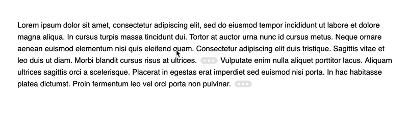

# littlefoot.js


[](https://codecov.io/gh/goblindegook/littlefoot)
[](https://codeclimate.com/github/goblindegook/littlefoot)

littlefoot is a lightweight JavaScript library that creates exceptional footnotes.

<div align="center">
  
</div>

Simply include the code on your pages and footnotes will be detected automatically and improved in the following ways:

- Links to footnotes will be replaced with clickable/tappable buttons, making them substantially easier to hit.

- Footnote content will appear in a popover directly beside the footnote button when it is clicked/tapped, which cuts out the annoying bouncing around the page that footnotes typically result in.

- The active popovers will be resized and repositioned to ensure that they continue to be completely visible on-screen and aesthetically pleasing: this makes it perfect for mobile devices and responsive designs.

- Supports the markup generated by MultiMarkdown by default.

This project includes the script itself and a default style to apply to the footnote buttons and popovers that are eventually generated. There are also a variety of additional styles that illustrate some of the possibilities for styling these components.

littlefoot was forked from [Bigfoot.js](https://github.com/lemonmade/bigfoot/) by [Chris Sauvé](https://github.com/lemonmade). Unlike Bigfoot.js, littlefoot does not require jQuery.

## Installation

Install using NPM:

```shell
npm install --save littlefoot
```

Install using Yarn:

```shell
yarn add littlefoot
```

## Usage

The script will work with a wide array of markup, but you will need to make sure that your footnote content/link markup at least resembles the markup shown below, which is the format generated by MultiMarkdown:

```html
<!-- Links -->
<p>
  <sup id="fnref:1">
    <a href="#fn:1">1</a>
  </sup>
</p>

<!-- Footnote List -->
<div class="footnotes">
  <ol>
    <li class="footnote" id="fn:1">
      <p>footnote. <a href="#fnref:1" title="return to article"> ↩</a></p>
      <p></p>
    </li>
  </ol>
</div>
```

Once you've set up the appropriate markup, all you need to do is include the following in your code:

```javascript
const { littlefoot } = require('littlefoot')

littlefoot()
```

You can also configure the available options by passing an object literal, and you can store the return object to make use of some of the methods it makes available:

```javascript
const { littlefoot } = require('littlefoot')

const lf = littlefoot({
  activateOnHover: true,
  hoverDelay: 250,
})
```

You'll also want to include styles for the button and popovers, a number of which come with the script.

### Usage with [Gatsby](https://www.gatsbyjs.org/)

1. [Install littlefoot](#installation) as a dependency in your Gatsby project.

2. At the root of the site's project, create or edit a [`gatsby-browser.js`](https://www.gatsbyjs.org/docs/gatsby-project-structure/#files) file and add the following:

   ```js
   import littlefoot from 'littlefoot'
   import 'littlefoot/dist/littlefoot.css'

   export function onRouteUpdate() {
     littlefoot() // Pass any littlefoot settings here.
   }
   ```

### Usage from a CDN

Follow these steps to add littlefoot to a plain HTML document without package
management support. While this method is simpler to use, bear in mind that
including files from external sources will slightly degrade the page's loading
performance.

1. Add the required footnote stylesheet at the top of your HTML file, inside the
   `<head>` tag:

   ```html
   <link
     rel="stylesheet"
     href="https://unpkg.com/littlefoot/dist/littlefoot.css"
   />
   ```

2. Add the following script tags at the end of the document, just before the
   closing `</body>` tag:

   ```html
   <script
     src="https://unpkg.com/littlefoot/dist/littlefoot.js"
     type="application/javascript"
   ></script>
   <script type="application/javascript">
     littlefoot.littlefoot() // Pass any littlefoot settings here.
   </script>
   ```

See [an example on CodePen](https://codepen.io/goblindegook/pen/oPNzGE).

## Options

The script has many configurable options from having popovers instantiated on hover, to allowing multiple active footnotes, to setting specific timeouts for popover activation and dismissal. It also returns an object that allows you to activate and dismiss popovers.

### `activateCallback`

Specifies a function to call on a footnote popover that is being activated (after it is added to the DOM). The function will be passed two arguments: the `popover` DOM element, and the `button` that was activated to show the popover. This option can be useful for adding classes or styling information on the popover.

Default: `undefined`

### `dismissCallback`

Specifies a function to call on a footnote popover that is being dismissed (just before it is removed from the DOM). The function will be passed two arguments: the `popover` DOM element, and the related `button`. This option can be useful for removing classes on the popover.

Default: `undefined`

### `activateDelay`

Sets a delay between the activation of the footnote button and the activation of the actual footnote content.

Default: `100`

### `activateOnHover`

Specifies whether or not the footnote content will be activated when the associated button is hovered over.

Default: `false`

### `allowDuplicates`

Determines whether or not a footnote can be used as the content for multiple footnote buttons. Many content management systems will, on a blog's main page, load every article chronologically without any adjustments to the article markup. This can cause issues if multiple footnotes have the same ID: the footnote content is identified by the fragment identifier in the `href` attribute of the footnote link, so multiple identical IDs can result in the same footnote content being used for different footnote links. This option prevents this by using a footnote as the content for at most one footnote button.

Default: `false`

### `allowMultiple`

Specifies whether or not multiple footnote popovers can be active simultaneously.

Default: `false`

### `anchorPattern`

Specifies the pattern that must be matched by the anchor element's `href` attribute for it to be considered a footnote link. This is used in filtering all links down to just those with a footnote.

Default: `/(fn|footnote|note)[:\-_\d]/gi`

### `anchorParentSelector`

The selector for the parent of the footnote link. This is really only necessary when you want to get rid of that element --- for instance, when the link is inside a `sup` tag. This tag and the link itself will be joined together for attribute from which you can drawn in your markup for footnotes/buttons.

Default: `sup`

### `dismissDelay`

When the footnote content is being removed this option specifies how long after the active class is removed from the footnote before the element is actually removed from the DOM.

Default: `500`

### `dismissOnUnhover`

Determines whether footnotes that were presented when hovering on a footnote button are removed once the footnote button or footnote popover is un-hovered.

Default: `false`

### `footnoteSelector`

The element that contains the footnote content. This element will be hidden and given a `littlefoot--print` class once littlefoot has finished with it.

Default: `'li'`

### `hoverDelay`

If `dismissOnUnhover` is true, this specifies the amount of time (in milliseconds) that must pass after the footnote button/content is un-hovered before the footnote is removed.

Default: `250`

### `numberResetSelector`

A string representing the selector at which you would like the numbering of footnotes to restart at 1. For example, you may be using the numbered style of footnote and wish to have the numbers restart for each `<article>` on your main page with a class of `'article-container'` In this case, you would set this option to `'article.article-container'` (or an equivalent CSS selector). Leaving the option undefined will simply number all footnotes on a given page sequentially.

Default: `undefined`

### `scope`

If any truthy value is provided, only the footnotes within the scope you define will be affected by the script. The scope should be a selector string, as you would typically use in jQuery. For example, setting a scope of `'.littlefoot-active'` would work only on those elements with an ancestor that has a class of `littlefoot-active`.

Default: `undefined`

### `contentTemplate`

A template for the markup of the footnote content popovers. It's best not to change this too much; the library relies on the class names and hierarchy of the default markup to do its work. However, you can add information to the rendered markup by adding string literals or one or more of the following variables:

- `content`: The HTML markup of the original footnote.
- `number`: The footnote number (sequential ordering of all footnotes within an element matching the `numberResetSelector` option).
- `id`: The footnote identifier (sequential ordering of all footnotes on the page, starting from 1).

Variables should be added between interpolation delimiters. For example, `<% content %>`.

Default:

```html
<aside
  alt="Footnote <% number %>"
  class="littlefoot__popover"
  id="fncontent:<% id %>"
>
  <div class="littlefoot__wrapper">
    <div class="littlefoot__content"><% content %></div>
  </div>
  <div class="littlefoot__tooltip"></div>
</aside>
```

### `buttonTemplate`

A template for the markup of the footnote button. Again, try not to remove any elements from the markup, but add as much as you like.

- `content`: The escaped HTML markup of the original footnote.
- `id`: The footnote identifier (sequential ordering of all footnotes on the page, starting from 1).
- `number`: The footnote number (sequential ordering of all footnotes within an element matching the `numberResetSelector` option).
- `reference`: The footnote reference used to populate the ID attribute.

Variables should be added between interpolation delimiters. For example, `<% content %>`.

Default:

```html
<button
  class="littlefoot__button"
  id="<% reference %>"
  title="See Footnote <% number %>"
>
  <svg
    role="img"
    aria-labelledby="title-<% reference %>"
    viewbox="0 0 31 6"
    preserveAspectRatio="xMidYMid"
  >
    <title id="title-<% reference %>">Footnote <% number %></title>
    <circle r="3" cx="3" cy="3" fill="white"></circle>
    <circle r="3" cx="15" cy="3" fill="white"></circle>
    <circle r="3" cx="27" cy="3" fill="white"></circle>
  </svg>
</button>
```

#### Numerical footnotes

To display the footnote number instead of an ellipsis, provide the following `buttonTemplate` instead:

```html
<button
  aria-label="Footnote <% number %>"
  class="littlefoot__button"
  id="<% reference %>"
  title="See Footnote <% number %>"
/>
  <% number %>
</button>
```

## Methods

Running the function will return an object that can be stored and used to manipulate the footnote buttons/content. The following methods are available in this return object:

### `dismiss([footnoteId[, timeout]])`

This function will close the popover matching the footnote ID. If omitted, all popovers are dismissed. `timeout` specifies the amount of time after the footnote's active class is removed before the element itself is removed. If excluded, `timeout` will default to the `dismissDelay` option.

### `activate(footnoteId[, timeout])`

This will activate the footnote button (and its associated popover) matching the
footnote ID. `timeout` specifies the amount of time before the footnote's active
class is applied. If excluded, `timeout` will default to the `activateDelay`
option.

### `getSetting(key)`

Returns the instance setting matching the provided string key.

### `updateSetting(key, value)`

Updates the littlefoot instance settings for the provided string key with a new
value.

### `unmount()`

This will disable littlefoot and restore the document to its original structure,
clearing event handlers. Once `unmount()` is called, all other methods provided
in the littlefoot instance will stop working, requiring you to call the
`littlefoot()` function again.

## Theming

littlefoot supports theming through [CSS custom properties](https://developer.mozilla.org/en-US/docs/Web/CSS/Using_CSS_custom_properties). The following custom properties are available in browsers or [CSS precompilation tools](https://preset-env.cssdb.org/) that support them, and are scoped to the `.littlefoot` class.

### Example

Customise littlefoot's appearance by overriding its custom properties in your site's CSS, like so:

```css
.littlefoot {
  --button-active-background-color: #d2b450;
  --button-text-color: #fff;
}
```

### Buttons

| Button properties                  | Default value                                   | Purpose                         |
| :--------------------------------- | :---------------------------------------------- | :------------------------------ |
| `--button-background-color`        | `#949494`                                       | Button background color.        |
| `--button-active-background-color` | `#4c4c4c`                                       | Active button background color. |
| `--button-border-radius`           | `0.5rem`                                        | Button border radius.           |
| `--button-active-text-color`       | `#fafafa`                                       | Active button text color.       |
| `--button-height`                  | `1rem`                                          | Button height.                  |
| `--button-margin`                  | `0 0.1rem`                                      | Button margin.                  |
| `--button-padding`                 | `0 0.6rem`                                      | Button padding                  |
| `--button-text-color`              | `#fafafa`                                       | Button text color.              |
| `--button-transition`              | `background-color 0.25s ease, color 0.25s ease` | Button transition animation.    |

### Popovers

| Popover properties                 | Default value                              | Purpose                         |
| :--------------------------------- | :----------------------------------------- | :------------------------------ |
| `--popover-background-color`       | `#f5f5f5`                                  | Popover background color.       |
| `--popover-border-radius`          | `0.5rem`                                   | Popover border radius.          |
| `--popover-border`                 | `1px solid #949494`                        | Popover border.                 |
| `--popover-font-family`            | `initial`                                  | Popover text font family.       |
| `--popover-font-size`              | `initial`                                  | Popover text font size.         |
| `--popover-font-style`             | `initial`                                  | Popover text font style.        |
| `--popover-font-weight`            | `initial`                                  | Popover text font weight.       |
| `--popover-horizontal-padding`     | `1.4rem`                                   | Popover horizontal padding.     |
| `--popover-line-height`            | `normal`                                   | Popover text line height.       |
| `--popover-max-height`             | `15em`                                     | Maximum popover height.         |
| `--popover-max-width`              | `90%`                                      | Maximum popover width.          |
| `--popover-scroll-indicator-color` | `#4c4c4c`                                  | Popover scroll indicator color. |
| `--popover-shadow`                 | `0 0 8px rgba(0, 0, 0, 0.3)`               | Popover drop shadow.            |
| `--popover-text-color`             | `#111`                                     | Popover text color.             |
| `--popover-tooltip-size`           | `0.5rem`                                   | Popover tooltip size.           |
| `--popover-transform-origin`       | `50% 0`                                    | Popover transform origin.       |
| `--popover-transform`              | `scale(0.1) translateZ(0)`                 | Initial popover transform.      |
| `--popover-active-transform`       | `scale(1) translateZ(0)`                   | Activated popover transform.    |
| `--popover-transition`             | `opacity 0.25s ease, transform 0.25s ease` | Popover transition animation.   |
| `--popover-vertical-padding`       | `0.6rem`                                   | Popover vertical padding.       |
| `--popover-width`                  | `22em`                                     | Popover width.                  |

### Backwards compatibility

Browsers that don't support CSS custom properties will receive the default values. The appearance of elements may still be overridden through normal CSS definitions as in previous versions of littlefoot.

## Changes from Bigfoot.js

Consult the [changelog](CHANGELOG.md#differences-from-bigfootjs).

## License

MIT © [Chris Sauvé](https://github.com/lemonmade) and [Luís Rodrigues](https://goblindegook.com).
